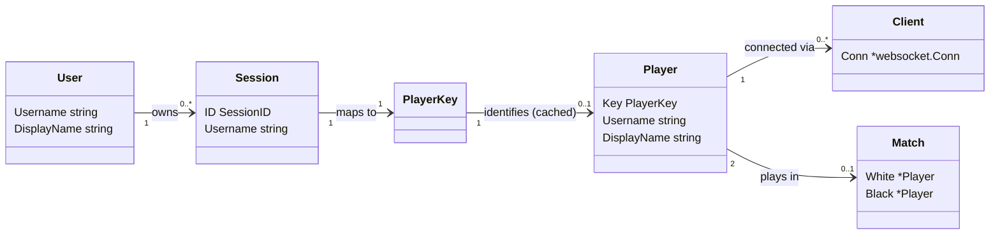
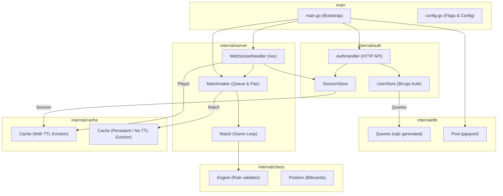
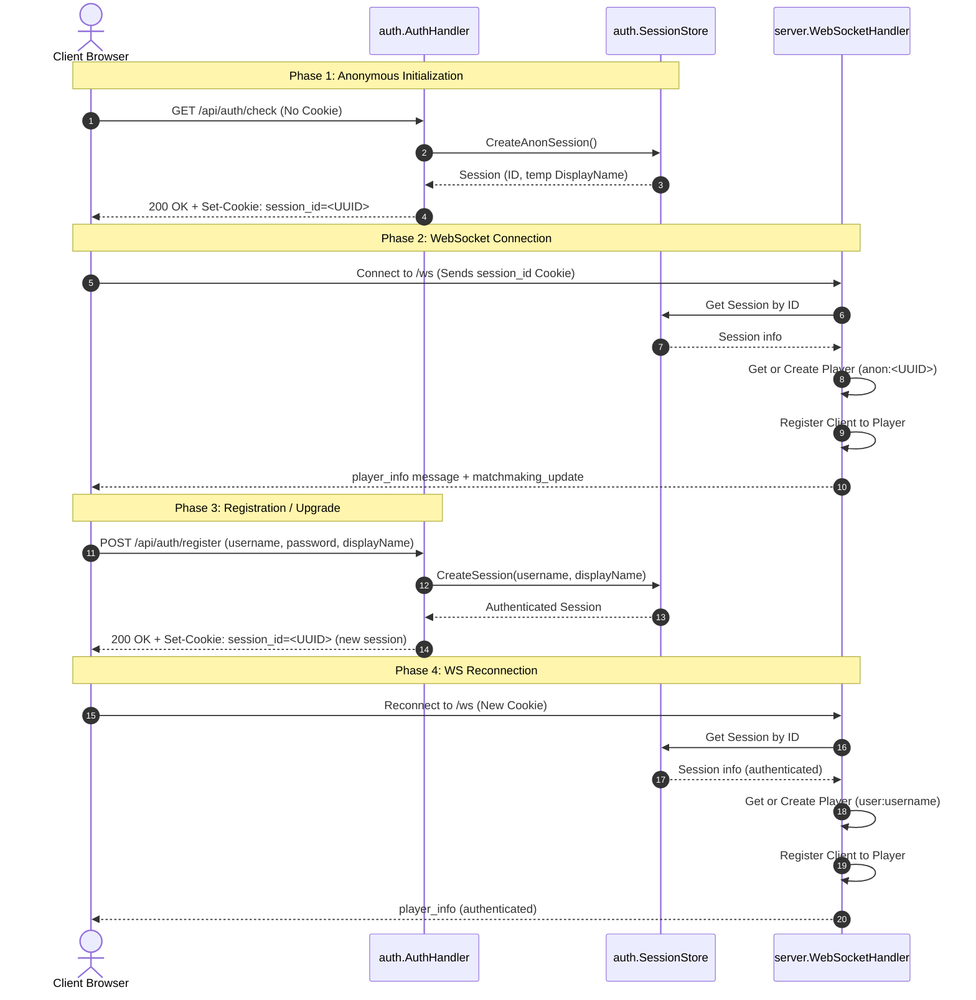
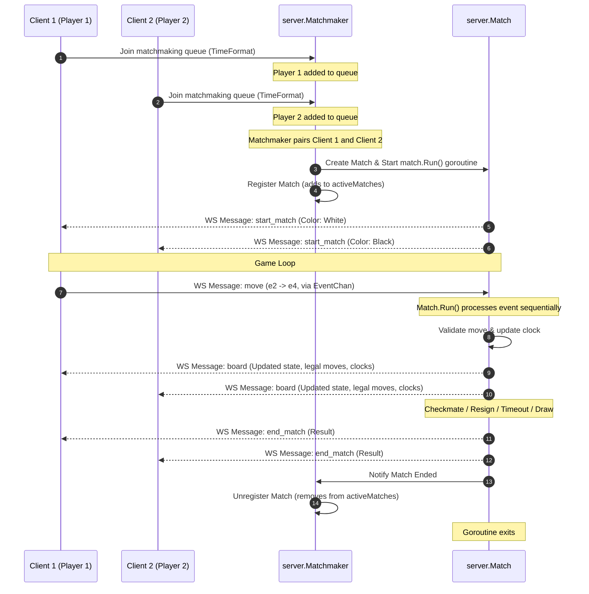

# Backend Architecture & Conceptual Flows

This document explains the architecture of the go-chess backend, defines its core concepts, and visualizes the lifecycles of connections and games.

## Core Concepts

The backend is built around a few central entities that manage user identity, network connections, and gameplay state:

*   **User (`auth.User`)**: A persistent user identity registered in the system (stored in the PostgreSQL database). Contains credentials (hashed via bcrypt) and a display name. Stored and queried via the `UserStore`.
*   **Session (`auth.Session`)**: A temporary session representation. Each session can be **anonymous** (temp guest name, not registered) or **authenticated** (tied to a `User`). Sessions are identified by a `SessionID` (UUID) stored in the client's secure HTTP-only `session_id` cookie. Valid sessions are cached for 24 hours in the `SessionStore`.
*   **PlayerKey (`server.PlayerKey`)**: A unique string key used to bridge the authentication layer (`auth`) and the gameplay layer (`server`). 
    *   For authenticated users, the format is `"user:<username>"`.
    *   For anonymous users, the format is `"anon:<sessionID>"`.
*   **Player (`server.Player`)**: The in-memory identity of an active player on the server. Players are cached in `WebSocketHandler.players`. They track matchmaking queues they have joined and matches they are currently playing.
*   **Client (`server.Client`)**: Represents a single active WebSocket connection (`*websocket.Conn`). A `Client` runs concurrent read/write loops. Every `Client` belongs to exactly one `Player`, but a `Player` can have multiple `Client` connections.
*   **Matchmaker (`server.Matchmaker`)**: A central component operating on an actor-like model (running in a single goroutine). It maintains queues for different time formats and pairs matching players.
*   **Match (`server.Match`)**: An active game session between two players. It runs in its own goroutine and communicates with clients via thread-safe, sequential event channels (`EventChan`), shielding game state mutations from concurrent access.
*   **Engine (`chess.Engine`)**: A pure, dependency-free domain model that represents the chess game state (board, castling rights, active color, move history) and handles move verification/legal move generation.

## Concept Relationships & Multiplicities

A player can open multiple tabs in their browser, which means one `Player` can map to multiple WebSocket `Client` connections simultaneously. Similarly, a registered `User` can have multiple active sessions on different devices.

## High-Level System Architecture

The codebase separates concerns into isolated packages. `chess` and `cache` are generic, utility-level packages with no internal dependencies, while `server` orchestrates them using sessions from `auth`.

## User Connection & Registration Flow

This flowchart outlines how anonymous visitors receive temporary sessions, connect via WebSockets, register/login to upgrade their session, and reconnect under their authenticated identity.

## Matchmaking & Gameplay Lifecycle

Games are created by the `Matchmaker` and managed in separate goroutines by the `Match` instance. Client interaction occurs via `MessageHandlers` which dispatch to a serialized internal `EventChan` to prevent concurrent modification of the active game state.

